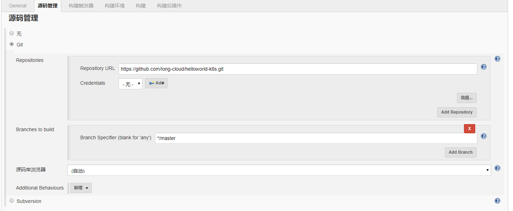
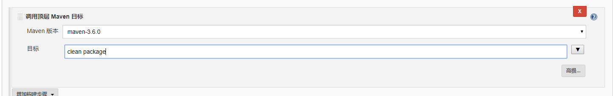

#
# kubernetes 快速安装

本文将手把手教您快速搭建kubernetes(1.11.4)服务编排工具。并基于持续集成工具（jenkins）快速发布自己的应用。

### （一）安装准备

**1. 系统要求。**

操作系统版本： CentOS 7.3；

内存：至少4GB；

**2. 确保服务器上已经正确安装iptables服务。**

执行命令 `systemctl status iptables` 检查iptables是否正确安装。如果显示`Unit iptables.service could not be found.`说明没有安装iptables，执行如下命令安装iptables服务。
````
# Install iptables service
yum install -y iptables-services
# Restart iptables service
systemctl restart iptables
# Set iptables on when system startup
chkconfig iptables on
````

**注意：CentOS 7.0 以上版本默认使用firewalld作为系统默认防火墙，此处我们需要禁用firewalld服务。使用如下命令禁用firewalld防火墙。**
````
# Stop firewalld service
systemctl stop firewalld
# Disable firewalld
systemctl disable firewalld
````

在master节点上添加防火墙规则，对外开放80与443端口，内部集群之间需要开放全部访问权限。编辑`/etc/sysconfig/iptables`文件，添加如下规则

````
#外部服务通过80或者443端口访问kubernetes集群中的服务
-A INPUT -m state --state NEW -m tcp -p tcp --dport 80 -j ACCEPT
-A INPUT -m state --state NEW -m tcp -p tcp --dport 443 -j ACCEPT

#192.168.56.0/24为集群内网网段，根据自己的实际环境填写
-A INPUT -s 192.168.56.0/24 -j ACCEPT

#10.1.0.0/16为容器网段
-A INPUT -s 10.1.0.0/16 -j ACCEPT

#注释掉如下两行
#-A INPUT -j REJECT --reject-with icmp-host-prohibited
#-A FORWARD -j REJECT --reject-with icmp-host-prohibited
````

保存规则后，执行`systemctl restart iptables`重启iptables服务。

**3. 确保集群中每台机器有唯一的主机名称。**

使用如下命令修改主机名称

hostname <your_hostname>

修改`/etc/hostname`文件，使其永久生效。

**注意：主机名格式：由英文小写字母、数字和 “-” 组成，以字母或数字开头。例如：longcloud01, longcloud-01。**

**4. 配置hosts文件。**

新增如下解析
vi /etc/hosts
````
127.0.0.1 kubernetes-master
````
将127.0.0.1 换成kubernetes master节点实际的IP地址。

**5. 确保机器能够连接互联网。**


### （二） 安装kubernetes master节点

执行/bin目录中的 `kube-master-installer.sh`命令快速安装kubernetes master节点。此脚本执行时需要一个参数。例如

`kube-master-installer.sh 192.168.56.203`

其中，`192.168.56.203`是您的kubernetes master所在节点的IP地址。

脚本执行完成后，即完成kubernetes master节点以及相关服务的安装。

系统默认安装了kubernetes-dashboard与jenkins服务。您可以通过如下地址访问

#### 1. kubernetes-dashboard ####

访问地址： `http://< your_master_ip >:8080/api/v1/namespaces/kube-system/services/https:kubernetes-dashboard:/proxy/#!/login`
其中`<your_master_ip>`填写kubernetes master节点的IP地址。打开后，直接点击“跳过”按钮，即可登录dashboard。

#### 2. jenkins ####

访问地址：`http://< your_master_ip > :8010`
其中`<your_master_ip>`填写kubernetes master节点的IP地址。

jenkins首次登陆后，需要进行如下配置

**2\.1 获取登录密码**

jenkins安装成功后，管理员密码默认写入到文件中，您可通过如下命令获取密码。登录master节点，执行如下命令

````
docker exec jenkins cat /var/jenkins_home/secrets/initialAdminPassword
````

使用此密码jenkins。

**2\.2 安装插件**

登录成功后，第一步选择需要安装的插件。我们选择“安装推荐的插件”。然后等待系统自动完成。

创建第一个管理员用户
这里我们使用用户名为：admin,密码也为：admin，来创建管理员用户。然后点击"保存并完成"。


实例配置，使用默认地址即可。

最后点击“开始使用jenkins”。

**2\.3安装docker与kubernetes插件**

打开“系统管理”->“插件管理”。选择“可选插件”，搜索“CloudBees Docker Build and Publish”插件，勾选后点击“直接安装”。

同样，搜索“Kubernetes Continuous Deploy”与“Build Timestamp”，勾选后点击“直接安装”。

**2\.4 配置Build Timestamp插件**

此时间戳将作为docker镜像的tag。时间戳格式：yyyyMMddHHmmss

打开“系统管理”->“系统设置”。


**2\.5 配置全局maven**

打开“系统管理”->“全局工具配置”。点击“新增Maven”，如下图配置（安装时，已经在对应目录中安装好maven，这里只需要配置对应路径即可）


#### 3. 开始自动化构建第一个应用程序 ####

**3\.1 新建“helloworld-k8s”任务**

回到主菜单。点击“新建任务”。名称为“helloworld-k8s”。


**3\.2 配置“参数化构建过程”**

配置两个字符参数（下面构建过程中使用）：appName与registryAddress两个参数。


**3\.3 选择源代码仓库地址**

此处，我们演示的git仓库地址为：https://github.com/long-cloud/helloworld-k8s.git


**3\.4增加构建步骤-maven打包**

点击“增加构建步骤”->“调用顶层maven目标”。按照下图所示配置



**3\.5 增加构建步骤-Docker Build and Publish**

点击“增加构建步骤”->“Docker Build and Publish”。按照下图所示配置


**3\.6增加构建步骤-Deploy to Kubernetes**

点击“增加构建步骤”->“Deploy to Kubernetes”。


新增Kubeconfig，点击“Add”->"jenkins"。如下图所示


kubeconfig配置文件

````
apiVersion: v1
kind: Config
clusters:
  - cluster:
      server: http://192.168.56.203:8080/ #此地址需要换成k8s master 节点的ip地址
    name: local
contexts:
  - context:
      cluster: local
    name: local
current-context: local
````

保存kubeconfig后，按照如下配置


配置完成后，保存任务配置信息。

**3\.7 构建任务**

点击“Build with Parameters”按钮，开始构建任务。

可以通过“控制台输出”查看构建过程。

**3\.8 访问发布helloworld-k8s**

地址： `http://< your_master_ip >/helloworld-k8s/`
如果浏览器显示`Hello World Demo @龙云`字样，说明helloworld-k8s应用已经正确运行。


### （三） 安装kubernetes node节点

执行/bin目录中的`kube-node-installer.sh`,kube-node-installer同kube-master-installer一样，也必须传输kubernetes master所在机器的IP地址作为其参数。例如
````
kube-node-installer.sh 192.168.56.203
````

安装程序执行完后，在kubernetes master节点上执行`kubectl get nodes`命令查看新加节点是否可以使用。


### （四） kubernetes 常用命令

kubernetes包括如下几个常用资源对象

| 序号 | 资源类型 | 资源名称 | 描述 |
|:---|:---|:---|:---|
|1|namespace|命名空间|多租户时使用，不同用户使用不同的命名空间|
|2|node|节点|集群运行的节点|
|3|deployment|部署|新的副本控制器。相对于ReplicationController，deployment能够平滑升级|
|4|ReplicationController|副本控制器|定义应用期望运行的副本数。kubernetes调度器会根据此副本数生成应用实例数目|
|5|service|服务|是应用之间互相访问的入口。一个服务创建后，拥有唯一的clusterIP。同时，服务起到负载均衡作用|
|6|pod|pod|kubernetes中调度的最小单元。一个pod包括一个应用功能实例容器和一个pod容器|
|7|ingress|ingress|外网访问入口。可选则nginx-ingress，HAProxy-ingress等等。|
|8|endpoints|endpoints|每个实例的网段端点|

对于如上资源，kubernetes提供了如下几个常用命令

**1. 查看所有指定类型资源**

`kubectl get <resourceType>`

例如：
查看所有节点
`kubectl get pods`
`kubectl get pods -o wide # 使用wide格式输出`
`kubectl get pods -o yaml #使用yaml格式输出`

**2. 查看资源详细信息**

`kubectl describe <resourceType> <resourceName>`

例如：查看pod名称为`helloworld-k8s-6fff87fc75-89j9m`的详细信息

`kubectl describe pods helloworld-k8s-6fff87fc75-89j9m`

**3. 创建资源**

`kubectl create -f <resourceFile>`

例如：创建一个deployment资源

`kubectl create -f bus_deployment.yaml`

**4. 更新资源**

`kubectl apply -f <resourceFile>`

**5. 删除资源**

`kubectl delete -f <resourceFile>`

我们还可以使用kubernetes Restful API操作资源。

详细接口参见kubernetes[官方文档](https://kubernetes.io/docs/reference/generated/kubernetes-api/v1.10/)。


### （五） Q&A

1. 容器地址与宿主机地址冲突了怎么办？

答：系统默认从`10.1.0.0`网段为容器分配地址。

修改flannel服务网段。执行命令`etcdctl set /coreos.com/network/config '{"Network":"10.1.0.0/16"}'`，将`10.1.0.0/16`替换成期望的容器地址网段，
譬如：`192.168.0.0/16`。

修改kubernetes service网段。修改`/etc/kubernetes/apiserver`配置文件中的`KUBE_SERVICE_ADDRESSES_RANGE`配置，将此地址网段修改为期望的地址网段。
修改后执行`systemctl restart kube-apiserver kube-controller-manager kube-scheduler`重启此三个服务。

2. 最终提示安装成功，但是dashboard与jenkins地址无法访问？

答： 请浏览安装日志。找到有明显失败或错误提示的日志。

常见的错误

1. etcd服务安装失败：执行`rm -rf /var/lib/etcd/default.etcd/*`删除etcd数据文件后重新安装。


